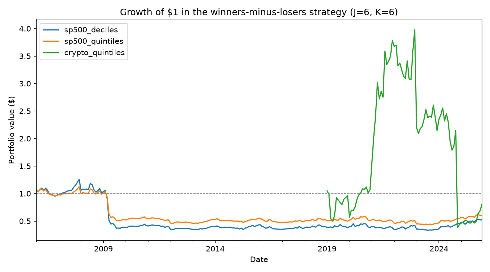

# Results

*Filled in from the experiment run on 2026-09-29.*

## Headline results (J=6, K=6, skip=0)

| Experiment | Gross mean monthly return | HAC t-stat | Annualized Sharpe | Net (cost-adjusted) mean monthly |
|---|---|---|---|---|
| S&P 500 deciles | -0.11% | -0.32 | -0.08 | -0.18% |
| S&P 500 quintiles | -0.12% | -0.46 | -0.11 | -0.19% |
| Crypto quintiles | 2.01% | 1.05 | 0.39 | 1.81% |

## Full grid

See `results/results_grid.csv` for all 32 `(J, K, skip)` combinations per dataset.

## Sub-period stability

| Experiment | Period | Mean monthly return | HAC t-stat |
|---|---|---|---|
| S&P 500 deciles | 2005-2012 | -0.96% | -1.19 |
| S&P 500 deciles | 2013-2019 | +0.02% | 0.04 |
| S&P 500 deciles | 2020-2025 | +0.60% | 1.05 |
| S&P 500 quintiles | 2005-2012 | -0.77% | -1.28 |
| S&P 500 quintiles | 2013-2019 | -0.05% | -0.15 |
| S&P 500 quintiles | 2020-2025 | +0.35% | 0.78 |
| Crypto quintiles | 2019-2021 | +7.31% | 2.16 |
| Crypto quintiles | 2022-2025 | -1.14% | -0.41 |

Neither dataset shows a statistically significant momentum effect (all |t| < 2) at the
headline setting, but the two datasets fail in different, informative ways.

**S&P 500:** the full-sample effect is essentially flat-to-negative and never
statistically significant in any sub-period. It's worst in 2005-2012, which includes
the 2008-2009 financial crisis, a period widely associated with sharp "momentum crash"
episodes in the academic literature, and drifts toward small and positive but still
insignificant by 2020-2025. There's no stable, persistent effect here.

**Crypto:** the positive headline number is not a stable effect. It's almost entirely
driven by one sub-period. 2019-2021 alone produced a large, statistically significant
result (+7.31%/month, t=2.16), while 2022-2025 was negative and insignificant (-1.14%,
t=-0.41). Averaging those two very different regimes together is what produces the
positive-but-insignificant headline number. This looks like it's capturing a single
strong bull-market trending period rather than a persistent cross-sectional momentum
effect.

## Validation against Ken French's momentum factor

Correlation: 0.93

## Interpretation

Using the pre-registered rule (|HAC t| > ~2 = significant):

- **S&P 500 (deciles and quintiles): Absent.** The effect is small, sits near zero,
  and is not statistically significant in the full sample or in any sub-period.
- **Crypto: Weaker / regime-dependent.** The full-sample number is positive but not
  significant. The one sub-period that *is* significant (2019-2021) is a single bull
  market, not a repeatable pattern, the following period reversed it. I would not
  call this "same as the original paper," since the original found a stable effect
  across its full sample, not one driven by a single regime.

## What matched the original paper, and what didn't

My predictions (from `docs/PROTOCOL.md`) were that S&P 500 would show a real but
weaker positive effect, and that crypto would show a larger but noisier one. What
actually happened was more extreme than predicted: **the S&P 500 effect wasn't just
weaker, it was absent**, flat to slightly negative rather than a diminished positive.
Crypto matched the "noisier, larger raw effect" prediction, but not in the way I
expected. Rather than noise scattered randomly around a positive average, the entire
result came from one concentrated bull-market period.

This is a genuine divergence from the original 1965-1989 result, not a replication of
it. A plausible explanation, consistent with published finance research, is that
momentum's profitability in U.S. equities has decayed since the effect became widely
known and traded on following the original paper's publication, sometimes called
"alpha decay" from crowding, combined with this sample including the 2008 crisis,
a period specifically associated with momentum strategies performing unusually badly.

## Threats to validity

- The S&P 500 sample (2005-2025) is dominated by two unusual regimes for momentum:
  the 2008 crisis and its aftermath, and the 2020 COVID crash/recovery, both known
  to be difficult periods for momentum strategies specifically. A different 20-year
  window might show a different picture.
- The crypto "effect" is a single sub-period result; with only two roughly 3-year
  sub-periods, there isn't enough independent data to call 2019-2021 anything more
  than one data point.
- As noted in `docs/PROTOCOL.md`, survivorship bias in both universes pushes toward
  *understating* the winners-minus-losers spread (failed/delisted names are missing
  from both legs, but especially the loser leg), so the true historical effect, if any
  existed, may have been even more negative/flat than measured here.

## Possible follow-ups

- [ ] Re-run S&P 500 excluding 2008-2009 to see if the crisis period alone is driving
      the negative full-sample result
- [ ] Split crypto into more, shorter sub-periods (e.g., yearly) to see how isolated
      the 2019-2021 result really is
- [ ] Try a longer/shorter formation window (other rows in `results_grid.csv`) to see
      if J=6,K=6 specifically is unlucky, or if the absence of an effect is consistent
      across the whole grid
